### Class #1

#### Fundamentos de Epidemiologia 2021

Francisco Pina Martins

[@FPinaMartins](https://twitter.com/FPinaMartins)

[@FPinaMartins@scholar.social](https://scholar.social/@FPinaMartins) (Fediverse)

---

## Epidemiology jump-start

---

### What is Epidemiology?

* &shy;<!-- .element: class="fragment" -->The word comes from Greek:
  * &shy;<!-- .element: class="fragment" -->*epi* (on or upon)
  * &shy;<!-- .element: class="fragment" -->*demos* (people)
  * &shy;<!-- .element: class="fragment" -->*logos* (the study of)
* &shy;<!-- .element: class="fragment" -->What happens to a population
* &shy;<!-- .element: class="fragment" -->["Study of the distribution and determinants of health related states or events in specified populations and its application to the control of health problems"](https://www.cdc.gov/csels/dsepd/ss1978/lesson1/section1.html)

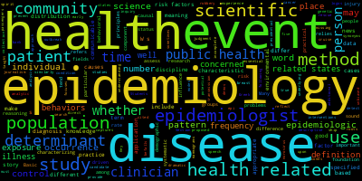

---

### Studying epidemiology

* &shy;<!-- .element: class="fragment" -->Biologists
* &shy;<!-- .element: class="fragment" -->Medical Doctors
* &shy;<!-- .element: class="fragment" -->Public Health Specialists
* &shy;<!-- .element: class="fragment" -->Statisticians
* &shy;<!-- .element: class="fragment" -->Computational Scientists

---

### A bit of history

---

### The birth of a discipline

  
  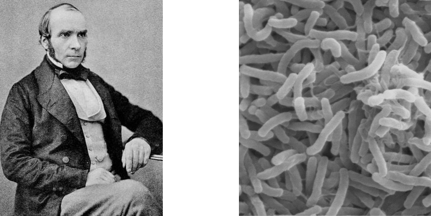

* &shy;<!-- .element: class="fragment" -->John Snow: 1813-1858
* &shy;<!-- .element: class="fragment" -->Cholera: Death rate > 50% without medical attention
* &shy;<!-- .element: class="fragment" -->*Vibrio choleara*; passed via dirty water
* &shy;<!-- .element: class="fragment" -->1830, 1840 and 1849 outbreaks

---

### Outbreaks. Outbreaks everywhere

* &shy;<!-- .element: class="fragment" -->Cause was unknown (*Miasma theory*)
* &shy;<!-- .element: class="fragment" -->JS looked at water sources
  * &shy;<!-- .element: class="fragment" -->Southwark and Vauxhall (Thames)
  * &shy;<!-- .element: class="fragment" -->Lamberth (Upstream)
  * &shy;<!-- .element: class="fragment" -->*Sw* and *Vx* were 14x more likely to die than *Lm*
  * &shy;<!-- .element: class="fragment" -->It was waterborne!
* &shy;<!-- .element: class="fragment" -->1849 - JS links cholera and digestive system (vomiting and diarrhea)

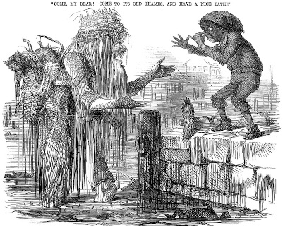

---

### Not on ~~night's~~ my watch!

* &shy;<!-- .element: class="fragment" -->1954 - Outbreak in Soho
  * &shy;<!-- .element: class="fragment" -->500 dead
  * &shy;<!-- .element: class="fragment" -->JS surveys the area (questions everyone)

  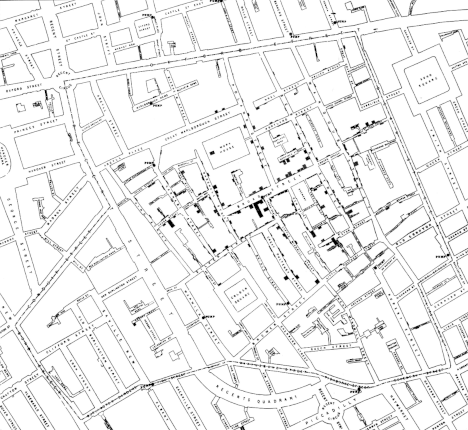
  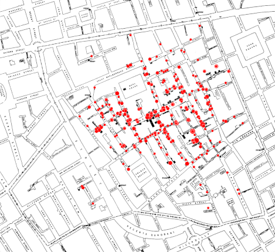
  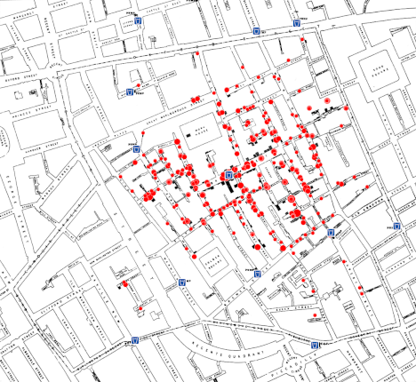

  

 
 
 

&shy;<!-- .element: class="fragment" -->Day was saved!
&shy;<!-- .element: class="fragment" -->(Yay!)

---

### The 5 epidemiological questions

?

* &shy;<!-- .element: class="fragment" -->Just like in journalism:
  * &shy;<!-- .element: class="fragment" -->What?
    * &shy;<!-- .element: class="fragment" -->A new respiratory system disease!
  * &shy;<!-- .element: class="fragment" -->Who?
    * &shy;<!-- .element: class="fragment" -->Mostly adults!
  * &shy;<!-- .element: class="fragment" -->Where?
    * &shy;<!-- .element: class="fragment" -->Wuhan, China!
  * &shy;<!-- .element: class="fragment" -->When?
    * &shy;<!-- .element: class="fragment" -->December 2019!
  * &shy;<!-- .element: class="fragment" -->Why/How?
    * &shy;<!-- .element: class="fragment" -->New type of coronavirus!/Droplet transmission!

---

### Base Epidemiological concepts

---

### Epidemiological Concepts I

* **Determinants**
  * Causes that influence disease occurrence
* **Risk-factor**
  * Any studied agent that can *potentially* influence disease occurrence
* Both are disease specific

 
 

 

* **Sentinel cases**
  * First reported cases
* **Epidemic**
  * Sudden **regional** rise in disease occurrence
* **Pandemic**
  * Sudden **global** rise in disease occurrence

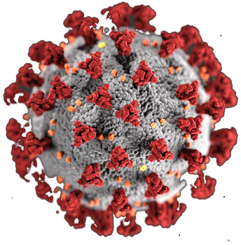

---

### Epidemiological Concepts II

* **Ecological fallacy**
  * Assume that a given relationship found in group level is also true at individual level
* **Biological fallacy**
  * Assume that a given relationship found at individual level is also true in group level
 
 

* **Mortality**
  * Deaths due to the studied disease
* **Morbility**
  * Diseased subjects

---

### Epidemiological measurements

---

### Measurement types

* &shy;<!-- .element: class="fragment" -->**Frequency** measurements
  * &shy;<!-- .element: class="fragment" -->Describe disease occurrence
* &shy;<!-- .element: class="fragment" -->**Association** measurements
  * &shy;<!-- .element: class="fragment" -->Measure association strength between *exposition* (independent variable) and *outcome* (dependent variable)
* &shy;<!-- .element: class="fragment" -->**Impact** measurements
  * &shy;<!-- .element: class="fragment" -->Measure prevention potential if exposition is eliminated

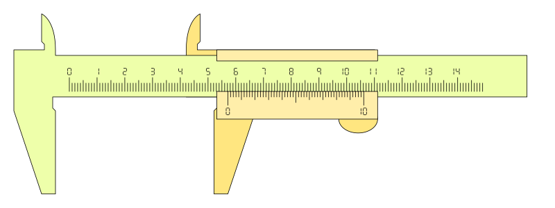

---

### Common frequency measurements

* &shy;<!-- .element: class="fragment" -->**Incidence**
 * &shy;<!-- .element: class="fragment" -->Frequency at which new cases **arise** in a given time frame
* &shy;<!-- .element: class="fragment" -->**Prevalence**
 * &shy;<!-- .element: class="fragment" -->Number of **active cases** in any moment in time
* &shy;<!-- .element: class="fragment" -->**Mortality** and **survivability** can be considered **Incdence** variants

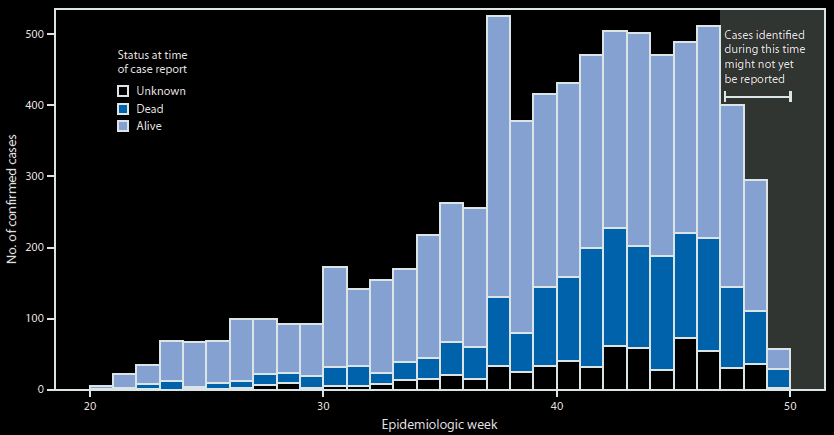

---

### Epidemiological study design

---

### Epidemiological study design

* &shy;<!-- .element: class="fragment" -->Observational
  * &shy;<!-- .element: class="fragment" -->Descriptive
  * &shy;<!-- .element: class="fragment" -->Analytical
    * &shy;<!-- .element: class="fragment" -->*Cross-sectional*
    * &shy;<!-- .element: class="fragment" -->*Prospective/follow up*
    * &shy;<!-- .element: class="fragment" -->*Retrospective/case-control*
* &shy;<!-- .element: class="fragment" -->Interventional
    * &shy;<!-- .element: class="fragment" -->*Randomized*
    * &shy;<!-- .element: class="fragment" -->*Non-Randomized*

 

---

### Descriptive observational studies

* &shy;<!-- .element: class="fragment" -->Describe disease occurrence patterns within a population
* &shy;<!-- .element: class="fragment" -->Low resource and time demands
* &shy;<!-- .element: class="fragment" -->Based on routinely collected data
* &shy;<!-- .element: class="fragment" -->Causation difficult to prove
* &shy;<!-- .element: class="fragment" -->Prone to *Ecological fallacy*
* &shy;<!-- .element: class="fragment" -->No control over bias or confounding effects
* &shy;<!-- .element: class="fragment" -->1st step for hypothesis proposals

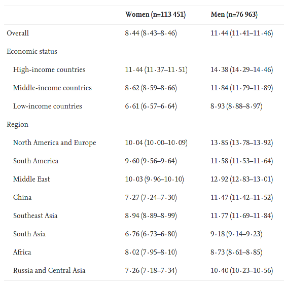

[Walli-Attaei et al. 2020](https://doi.org/10.1016/S0140-6736(20\)30543-2)

---

### Analytical observational studies

* &shy;<!-- .element: class="fragment" -->Find relationships between health status and other (risk) variables
* &shy;<!-- .element: class="fragment" -->Can be somewhat controlled for bias and confounding factors
* &shy;<!-- .element: class="fragment" -->Easier to make causal inferences than descriptive studies
 * &shy;<!-- .element: class="fragment" -->**Cross-sectional** (snapshot in time)
 * &shy;<!-- .element: class="fragment" -->**Prospective/follow up** 
   * &shy;<!-- .element: class="fragment" -->Exposed Vs. unexposed samples
   * &shy;<!-- .element: class="fragment" -->Focused on **risk factor effects**
 * &shy;<!-- .element: class="fragment" -->**Retrospective/case-control** (diseased vs. healthy samples)
   * &shy;<!-- .element: class="fragment" -->Diseased Vs. Healthy samples
   * &shy;<!-- .element: class="fragment" -->Focused on **disease causes**

|||

### Cross-sectional studies

|||

### Follow up studies

|||

### Case-control studies

---

### Interventional studies

*  &shy;<!-- .element: class="fragment" -->Involve changing variables in one or more samples
  *  &shy;<!-- .element: class="fragment" -->Compare outcomes between changed and kept samples
*  &shy;<!-- .element: class="fragment" -->Can be of various types:
  *  &shy;<!-- .element: class="fragment" -->Randomized control trial (golden standard)
  *  &shy;<!-- .element: class="fragment" -->Field trials
  *  &shy;<!-- .element: class="fragment" -->Community trials

---

### Randomized control trial

* &shy;<!-- .element: class="fragment" -->Performed on 2 (or more) groups
* &shy;<!-- .element: class="fragment" -->Subjects are randomly distributed between groups
* &shy;<!-- .element: class="fragment" -->One group is provided with no treatment, or with a standard treatment (**control group**)
* &shy;<!-- .element: class="fragment" -->Other groups are provided with a treatment (**treatment group**)
* &shy;<!-- .element: class="fragment" -->Outcomes are compared
* &shy;<!-- .element: class="fragment" -->[Many sub-types](https://doi.org/10.11613/BM.2014.022)!

|||

### Randomized control trial

---

### Epidemiological study design summary

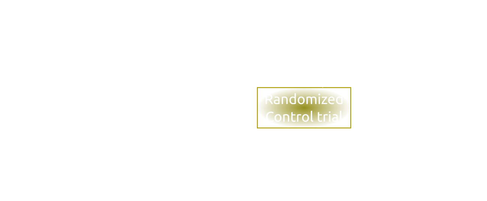

---

### The day that wasn't

---

### Infectious diseases

* Infectious diseases have always been major killers
 * Cause illness and/or death
 * Part of our everyday life 
* Sometimes a disease can spread very rapidly through a population
 * **Epidemic!**
   * Black Death
   * Spanish flu
   * COVID-19

---

### Infectious diseases II

* Caused by microorganisms
 * *Virii*
 * *Bacteria*
 * *Monera*
* Transmitted from person to person
 * Infection -> replication of foreign organism
 * Disease -> clinical symptoms
* We can have symptomatic and asymptomatic infection
 * Susceptible != resistant
* Infectious period

---

### Transmission

* Direct 
  * Airborne (droplets, large and small)
  * Sexual (such as HIV)
* Indirect
  * Intermediate carrier (objects)
  * Waterborne transmission (like cholera)
  * Vectorborne (mosquitoes, flies, fleas, etc.)

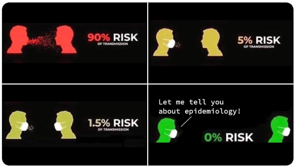

---

### Where does it start?

* One subject gets infected
 * Transmits the disease causing agent to at least one other person
* *Avg. number of secondary cases one case would produce in a completely susceptible population*
 * **R0** ("*R naught*")
* R0 is a biological reality!

|||

### Estimating R0

* Based on 3 essential parameters:
 * Contagiousness duration after infection (*t*)
 * Infection likelihood per contact between a susceptible and an infectious person/vector (*S*)
 * Contact rate (*C*)

`$$ R_0 = t \times S \times C $$`

* Other parameters can be used to further fine-tune the estimate
 * Environmental factors
 * Social organization
 * Seasonality
* Leads to complex mathematical models

|||

### The dark side of R0

* Imprecise
* Rests on assumptions
* Hides local variation

---

### An alternative from observable data

* Rt - *Effective R*
 * Calculated over time
 * Consideres intervention
 * Drops the "entierly susceptible population" assumption
 * Even harder to model than R0

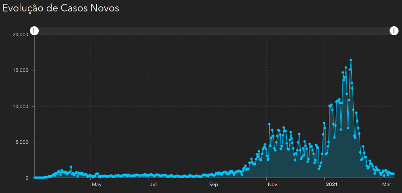

---

### But if you still want to have a go at it...

* [COVID-SIM](http://covidsim.eu/)
* [Nextstrain](https://nextstrain.org/ncov/global)
* [VAX](http://vax.herokuapp.com/)

---

### References

* [Definition of Epidemiology](https://www.cdc.gov/csels/dsepd/ss1978/lesson1/section1.html)
* [Medical Microbiology (Chapter 9: Epidemiology)](https://www.ncbi.nlm.nih.gov/books/NBK7993/)
* [The story of John Snow](https://sphweb.bumc.bu.edu/otlt/mph-modules/ph/publichealthhistory/publichealthhistory6.html)
* [Types of epidemiological studies](https://link.springer.com/protocol/10.1007%2F978-1-60327-416-6_3)
* [Randomized clinical trials types](https://doi.org/10.11613/BM.2014.022)
* [Why R0 is hard](https://wwwnc.cdc.gov/eid/article/25/1/17-1901_article)
* [The pandemic's misunderstood metric](https://www.nature.com/articles/d41586-020-02009-w)
* [Calculating a pandemic's variables](https://iris.paho.org/bitstream/handle/10665.2/52405/PAHOIMSPHECOVID-19200031_eng.pdf)
