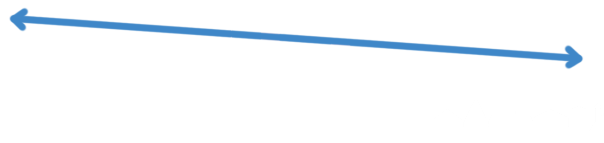
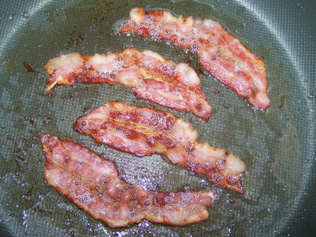
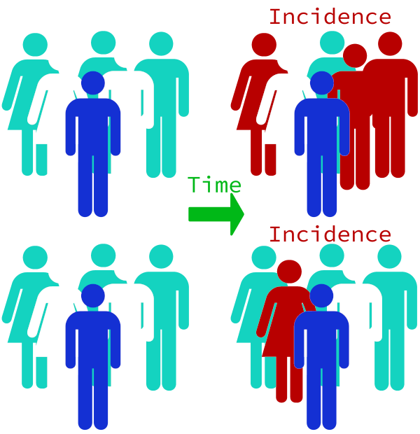
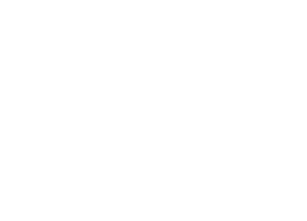
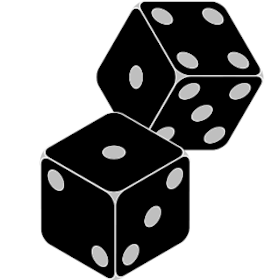
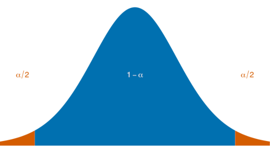
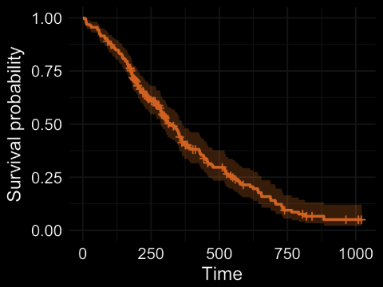

### Class #4

#### Fundamentos de Epidemiologia 2021


Francisco Pina Martins

[@FPinaMartins](https://twitter.com/FPinaMartins)

[@FPinaMartins@scholar.social](https://scholar.social/@FPinaMartins) (Fediverse)

---

### In depth: Cross sectional studies

---

### What are they?

* &shy;<!-- .element: class="fragment" -->&shy;<!-- .element: class="fragment" -->Like *follow-up* studies, start from a base population
* &shy;<!-- .element: class="fragment" -->&shy;<!-- .element: class="fragment" -->Only during a specific moment in time
 * &shy;<!-- .element: class="fragment" -->Prevalence
 * &shy;<!-- .element: class="fragment" -->Exposure
* &shy;<!-- .element: class="fragment" -->Select a population and then classify subjects on whether or not they present the *outcome*

|||


---

### Using Cross-sectional studies

* &shy;<!-- .element: class="fragment" -->Descriptive:
 * &shy;<!-- .element: class="fragment" -->Measure outcome prevalence in a population
 * &shy;<!-- .element: class="fragment" -->Exceptionally, the "moment" in time can be a (short) time period if data needs to accumulate
* &shy;<!-- .element: class="fragment" -->Analytical:
 * &shy;<!-- .element: class="fragment" -->Gather data on both *prevalence* and *exposure*
   * &shy;<!-- .element: class="fragment" -->Compare *outcome* differences on *exposed* and *unexposed*
 * &shy;<!-- .element: class="fragment" -->Compare proportion of *exposed*, diseased subjects with proportion of *unexposed*, diseased subjects. 

---

### C-S studies' measurements

<div class="fragment" data-fragment-index="1">

* Let's take this cholera table as an example:

|                               | Cholera | No cholera | Total |
|:---                           |:-------:|:----------:|:-----:|
| Within Broad St. range        | 60  [1] | 220   [2]  | 280   |
| Outside Broad St. range       | 40  [3] | 680   [4]  | 720   |
| Total:                        | 100     | 900        | 1000  |

</div>

<div class="fragment" data-fragment-index="2" style="float:left;width:45%">

* &shy;<!-- .element: class="fragment" -->Prevalence:
`$$ P = C/N  $$` `$$ P_E = 60/280 = 0.2143 $$` `$$ P_Ē = 40/680 = 0.05882 $$`

</div>

<div class="fragment" data-fragment-index="2" style="float:right;width:45%">

</br>
</br>

* &shy;<!-- .element: class="fragment" -->Where:
 * &shy;<!-- .element: class="fragment" -->*C* = Cases
 * &shy;<!-- .element: class="fragment" -->*N* = Total population

</div>

|||

### Ratios

<div class="fragment" style="float:left;width:45%">

* &shy;<!-- .element: class="fragment" -->Prevalence Odds Ratio:
`$$ POR = \frac{Q_1 \times Q_4}{Q_2 \times Q_3} $$`
`$$ POR = \frac{60 \times 680}{220 \times 40} = 4.636 $$`

</br>
</br>

* &shy;<!-- .element: class="fragment" -->Good if outcome takes time to develop

</div>

<div class="fragment" style="float:right;width:45%">

* &shy;<!-- .element: class="fragment" -->Prevalence Ratio:
`$$ PR = \frac{(Q_1/T_E)}{(Q_3/T_Ē)}  $$`
`$$ PR = \frac{(60/280)}{(40/720)} = 3.857 $$`

</br>
</br>

* &shy;<!-- .element: class="fragment" -->Good if outcome develops rapidly
* &shy;<!-- .element: class="fragment" -->Analogous to Risk Ratio

</div>

---

### Pros and Cons of C-S studies

<div class="fragment" style="float:left; width:50%">

#### Pros

* &shy;<!-- .element: class="fragment" -->Evaluate proportions of disease in populations
* &shy;<!-- .element: class="fragment" -->Estimate risk factors occurrence in population segments
 * &shy;<!-- .element: class="fragment" -->Age
 * &shy;<!-- .element: class="fragment" -->Gender
 * &shy;<!-- .element: class="fragment" -->Literacy, etc..
* &shy;<!-- .element: class="fragment" -->Political polls are c-s studies
* &shy;<!-- .element: class="fragment" -->Establishing preliminary evidence for causal relationships

</div>

<div class="fragment" style="float:right; width:50%">

#### Cons

* &shy;<!-- .element: class="fragment" -->Prevalence depends on:
 * &shy;<!-- .element: class="fragment" -->Incidence
 * &shy;<!-- .element: class="fragment" -->Duration
* &shy;<!-- .element: class="fragment" -->Dependant on survival bias
 * &shy;<!-- .element: class="fragment" -->New treatments
 * &shy;<!-- .element: class="fragment" -->Case-fatality-rate changes
 * &shy;<!-- .element: class="fragment" -->Migration
* &shy;<!-- .element: class="fragment" -->Chicken-egg problem: Which came first (*exposure* or *outcome*)?

</div>

---

### Ecological studies

---

### Main characteristics

* &shy;<!-- .element: class="fragment" -->Work at a population level
 * &shy;<!-- .element: class="fragment" -->No individual data
 * &shy;<!-- .element: class="fragment" -->Both outcome and exposure
* &shy;<!-- .element: class="fragment" -->Used to associate outcome and exposure
 * &shy;<!-- .element: class="fragment" -->No causation can be inferred
   * &shy;<!-- .element: class="fragment" -->No information on which outcomes were exposed

&shy;<!-- .element: class="fragment" -->

|||

### Ecological study examples

* &shy;<!-- .element: class="fragment" -->Is the ranking of cities by road traffic levels associated with the ranking of cities by mortality from pulmonary diseases, after adjusting for other factors?
* &shy;<!-- .element: class="fragment" -->Are a region's daily variations in mortality related to daily variations in nano-particle concentration?
* &shy;<!-- .element: class="fragment" -->What are the long-term time trends (decades long) for mortality from the cardiovascular diseases in each EU country?

&shy;<!-- .element: class="fragment" -->

---

### I thought you said these studies were interventional!

* &shy;<!-- .element: class="fragment" -->And they are - consider the following:
 * &shy;<!-- .element: class="fragment" -->Compare the prevalence of lung diseases in a region before and after laws on factory smoke filters are passed
 * &shy;<!-- .element: class="fragment" -->Compare "junk food" consumption before and after a large healthy eating habits campaign

&shy;<!-- .element: class="fragment" -->

---

### Types of Ecological study design:

* &shy;<!-- .element: class="fragment" -->Can be classified according to 2 criteria:
 * &shy;<!-- .element: class="fragment" -->Descriptive vs analytic;
 * &shy;<!-- .element: class="fragment" -->Subjects grouping:

</br>
</br>

<div class="fragment" style="float:left;width:33%">

**Multi-group ecological studies**
* Compare aggregate exposures and outcomes over the **same time** period in **different communities**

</div>

<div class="fragment" style="float:right;width:33%">

**Time-trend ecological studies**
* Compare variations in aggregate exposures and outcomes **over time** within the **same community**

</div>

<div class="fragment" style="float:right;width:33%">

**Mixed ecological studies**
* Investigate disease or risk factor differences **between communities throughout time**

</div>

---

### Pros and Cons of Ecological studies

<div class="fragment" style="float:left;width:50%">

### Pros

* &shy;<!-- .element: class="fragment" -->Aggregate data is easy to come by
* &shy;<!-- .element: class="fragment" -->Data is usually up-to-date
* &shy;<!-- .element: class="fragment" -->Inexpensive
* &shy;<!-- .element: class="fragment" -->Quick to perform
* &shy;<!-- .element: class="fragment" -->Very good to propose hypotheses

</div>

<div class="fragment" style="float:left;width:50%">

### Cons

* &shy;<!-- .element: class="fragment" -->Cannot extrapolate to individual level
* &shy;<!-- .element: class="fragment" -->Aggregate data suffers from bias and confounding
* &shy;<!-- .element: class="fragment" -->Migration is an important bias factor in time-trend studies
* &shy;<!-- .element: class="fragment" -->No way to establish causation

</div>

---

### Randomized Control Trials

---

### What are Randomized Control Trials (RCTs)?

* &shy;<!-- .element: class="fragment" -->Interventional studies
* &shy;<!-- .element: class="fragment" -->Two or more groups are **randomly** created
 * &shy;<!-- .element: class="fragment" -->Control group
 * &shy;<!-- .element: class="fragment" -->Treatment group(s)
* &shy;<!-- .element: class="fragment" -->Most direct evidence for causality

|||



---

### Types of controls

* &shy;<!-- .element: class="fragment" -->*Placebo controlled*
 * &shy;<!-- .element: class="fragment" -->Treatment group(s) are provided with a treatment
 * &shy;<!-- .element: class="fragment" -->Control group is provided with a placebo (AKA - no treatment)
* &shy;<!-- .element: class="fragment" -->*Active controlled*
 * &shy;<!-- .element: class="fragment" -->Treatment group(s) are provided with a treatment
 * &shy;<!-- .element: class="fragment" -->Control group is provided with a "standard" treatment

&shy;<!-- .element: class="fragment" -->

---

### Subject randomization

* &shy;<!-- .element: class="fragment" -->The goal is to make sure all groups have similar risk factors
 * &shy;<!-- .element: class="fragment" -->Larger samples result in better risk factor distribution
* &shy;<!-- .element: class="fragment" -->Randomizing strategies
 * &shy;<!-- .element: class="fragment" -->Full random
   * &shy;<!-- .element: class="fragment" -->Just toss a coin, or roll a die
 * &shy;<!-- .element: class="fragment" -->Stratified randomization
   * &shy;<!-- .element: class="fragment" -->First stratify subjects by a known risk factor, then randomize subjects from each strata into groups

&shy;<!-- .element: class="fragment" -->

|||

### Randomization assessment

* &shy;<!-- .element: class="fragment" -->Include  five  to  10 variables
 * &shy;<!-- .element: class="fragment" -->Demographic data (age, gender, race, ...)
 * &shy;<!-- .element: class="fragment" -->Severity of illness measures
 * &shy;<!-- .element: class="fragment" -->Other variables known to be related to the primary  outcome
* &shy;<!-- .element: class="fragment" -->Significance tests (*t-tests*, Chi²) should not report more than the number of expected values above *alpha*
 * &shy;<!-- .element: class="fragment" -->Eg. 1 in 20 for *alpha* = 0.05

&shy;<!-- .element: class="fragment" -->

---

### Types of RCTs

* &shy;<!-- .element: class="fragment" -->Clinical trials
 * &shy;<!-- .element: class="fragment" -->Subjects are patients
 * &shy;<!-- .element: class="fragment" -->Assess efficacy of a new treatment
* &shy;<!-- .element: class="fragment" -->Community trials
 * &shy;<!-- .element: class="fragment" -->Subjects are entire communities
 * &shy;<!-- .element: class="fragment" -->Assess efficacy if a new policy
 * &shy;<!-- .element: class="fragment" -->Limited in what conclusions can be drawn
 * &shy;<!-- .element: class="fragment" -->Overlap with ecological studies

&shy;<!-- .element: class="fragment" -->

---

### Blinding

* &shy;<!-- .element: class="fragment" -->Work-around to bias from subjects *knowing* they are being treated
* &shy;<!-- .element: class="fragment" -->Single-blind trials
 * &shy;<!-- .element: class="fragment" -->Subjects are unaware of their treatment group
 * &shy;<!-- .element: class="fragment" -->Controls for *post-rnadomization confounding bias*
* &shy;<!-- .element: class="fragment" -->Double-blind trials
 * &shy;<!-- .element: class="fragment" -->Subjects **and** investigators are unaware of the subjects' group
 * &shy;<!-- .element: class="fragment" -->Controls for *information bias* (get differential groups' details)
* &shy;<!-- .element: class="fragment" -->Triple-blind trials
 * &shy;<!-- .element: class="fragment" -->Subjects, investigators **and** independent statisticians are unaware of the subjects' treatment groups
 * &shy;<!-- .element: class="fragment" -->Also controls for *information bias* ("Look at this PCA pattern!")

&shy;<!-- .element: class="fragment" -->

---

### Threats to RCTs

* &shy;<!-- .element: class="fragment" -->Compliance
 * &shy;<!-- .element: class="fragment" -->Subjects may be non-compliant
 * &shy;<!-- .element: class="fragment" -->Non-compliant subjects should **not** be removed!
* &shy;<!-- .element: class="fragment" -->Crossover
 * &shy;<!-- .element: class="fragment" -->Switching subjects between groups
 * &shy;<!-- .element: class="fragment" -->Carryover effects
* &shy;<!-- .element: class="fragment" -->Loss to follow up
 * &shy;<!-- .element: class="fragment" -->Subjects may drop out differentially
 * &shy;<!-- .element: class="fragment" -->Especially "dangerous" if correlated with outcome related factors

---

### Phases

* &shy;<!-- .element: class="fragment" -->RCTs can also be classified in *Phases*
* &shy;<!-- .element: class="fragment" -->Phase 1 trials (Not really an RCT)
 * &shy;<!-- .element: class="fragment" -->20-80 *volunteers*
 * &shy;<!-- .element: class="fragment" -->Used to determine optimal dosing
 * &shy;<!-- .element: class="fragment" -->Document absorption, distribution, metabolism and excretion
 * &shy;<!-- .element: class="fragment" -->Identify short-term side-effects
* &shy;<!-- .element: class="fragment" -->Phase 2 trials
 * &shy;<!-- .element: class="fragment" -->100-300 patients
 * &shy;<!-- .element: class="fragment" -->Preliminary efficacy
 * &shy;<!-- .element: class="fragment" -->Blinded
 * &shy;<!-- .element: class="fragment" -->Look for more side-effects

|||

### Phases Pt. 2

* &shy;<!-- .element: class="fragment" -->Phase 3 trials
 * &shy;<!-- .element: class="fragment" -->1000-3000 patients
 * &shy;<!-- .element: class="fragment" -->*Gold standard* to establish safety and efficacy
 * &shy;<!-- .element: class="fragment" -->Blinded
 * &shy;<!-- .element: class="fragment" -->Long time periods
* &shy;<!-- .element: class="fragment" -->Phase 4 trials (Also, not really RCTs)
 * &shy;<!-- .element: class="fragment" -->Observational
 * &shy;<!-- .element: class="fragment" -->Total scale, after regulatory approval
 * &shy;<!-- .element: class="fragment" -->Long term risks and side-effects
 * &shy;<!-- .element: class="fragment" -->"Real world" efficacy

&shy;<!-- .element: class="fragment" -->[Would you like to know more?](https://dx.doi.org/10.2147%2FCOPD.S244942)

---

### Pros and Cons

<div class="fragment" style="width:55%; float:left">

### Pros

* &shy;<!-- .element: class="fragment" -->Strongest evidence for causation of any epidemiological study design
* &shy;<!-- .element: class="fragment" -->Minimizes confounding effects
* &shy;<!-- .element: class="fragment" -->Clear temporal sequence - exposure clearly precedes outcome
* &shy;<!-- .element: class="fragment" -->Strong basis for statistical inference
* &shy;<!-- .element: class="fragment" -->Blinding as a way to minimize bias
* &shy;<!-- .element: class="fragment" -->Can measure multiple outcomes simultaneously

</div>

<div class="fragment" style="width:45%; float:Right">

### Cons

* &shy;<!-- .element: class="fragment" -->Ethical constraints - it is not always ethical to manipulate exposure at random
* &shy;<!-- .element: class="fragment" -->Expensive and time consuming
* &shy;<!-- .element: class="fragment" -->Requires complex design and analysis
* &shy;<!-- .element: class="fragment" -->Generalisability - subjects in a RCT may be more compliant with treatment than general population

---

### RCT data analyses

* &shy;<!-- .element: class="fragment" -->RCTs will typically present 2x2 tables
* &shy;<!-- .element: class="fragment" -->Unlike previous studies, the goal is not to measure risk, but differences in proportions
* &shy;<!-- .element: class="fragment" -->...You guessed it:
 * &shy;<!-- .element: class="fragment" -->Chi² independence test
 * &shy;<!-- .element: class="fragment" -->Fisher's exact test
* &shy;<!-- .element: class="fragment" -->Let's look at an hypothetical trial for a new drug, that should make patients recover from a disease more often than the current known treatment

|||

### Small (Phase 2) example:

|           | Recovered | Diseased |
|:---       |:---------:|:--------:|
| Treatment | 32        | 10       |
| Control   | 21        | 23       |

<div class="fragment">

```R
phase_2 = matrix(c(32, 10, 21, 23), byrow=T, 2, 2)
colnames(phase_2) = c("Recovered", "Diseased")
rownames(phase_2) = c("Treatment", "Control")

fisher.test(phase_2)
```

</div>


|||

### Large (Phase 3) example:

|           | Recovered | Diseased |
|:---       |:---------:|:--------:|
| Treatment | 641       | 206      |
| Control   | 422       | 463      |

<div class="fragment">

```R
phase_2 = matrix(c(641, 206, 422, 463), byrow=T, 2, 2)
colnames(phase_2) = c("Recovered", "Diseased")
rownames(phase_2) = c("Treatment", "Control")

fisher.test(phase_2)
chisq.test(phase_2)

```

</div>

---

### Can we break this?

* &shy;<!-- .element: class="fragment" -->RCTs significance or CI will often hinge on a single or a few cases changing
* &shy;<!-- .element: class="fragment" -->How can we assess how close to not being significant a study is?
* &shy;<!-- .element: class="fragment" -->Meet the **Fragility index**:
 * &shy;<!-- .element: class="fragment" -->Proposed by [Walter 1991](https://www.sciencedirect.com/science/article/abs/pii/089543569190098T)
 * &shy;<!-- .element: class="fragment" -->["The smallest number of subjects whose status needs to change, for a statistically significant outcome to lose its statistical significance"](https://www.psychiatrist.com/read-pdf/21994/)

<div class="fragment">

```R
install.packages("fragility")
library(fragility)

my_frag = frag.study(e0=32, n0=42, e1=21, n1=44)
# e0 - numeric value indicating event count in group 0
# n0 - numeric value indicating sample size in group 0
# e1 - numeric value indicating event count in group 1
# n1 - numeric value indicating sample size in group 1

print(my_frag)
```

</div>

---

### What about survival?

* &shy;<!-- .element: class="fragment" -->To investigate associations between time to an event (Eg. death) and a set of variables, use "Cox Proportional-Hazards Model"
 * &shy;<!-- .element: class="fragment" -->It's outside this course's scope, but for future reference:
* &shy;<!-- .element: class="fragment" -->[Cox Proportional-Hazards Model - a guide in R](https://www.r-bloggers.com/2016/12/cox-proportional-hazards-model/)
* &shy;<!-- .element: class="fragment" -->[An alternative tutorial for CP-HM](https://argoshare.is.ed.ac.uk/healthyr_book/cox-proportional-hazards-regression.html)
* &shy;<!-- .element: class="fragment" -->[A third tutorial on CP-HM](https://stats.idre.ucla.edu/r/dae/mixed-effects-cox-regression/)

&shy;<!-- .element: class="fragment" -->

---

### References

* [A summary on cross-sectional studies](https://sph.unc.edu/wp-content/uploads/sites/112/2015/07/nciph_ERIC8.pdf)
* [Cross sectional studies for the uninitiated](https://thebmj-frontend.bmj.com/about-bmj/resources-readers/publications/epidemiology-uninitiated/8-case-control-and-cross-sectional)
* [A summary on ecological studies](https://sph.unc.edu/wp-content/uploads/sites/112/2015/07/nciph_ERIC9.pdf)
* [Ecologic Studies in Epidemiology: Concepts, Principles, and Methods](https://www.annualreviews.org/doi/10.1146/annurev.pu.16.050195.000425?url_ver=Z39.88-2003&rfr_id=ori%3Arid%3Acrossref.org&rfr_dat=cr_pub++0pubmed)
* [Randomized control trials - a summary](https://sph.unc.edu/wp-content/uploads/sites/112/2015/07/nciph_ERIC10.pdf)
* [Short notes on RCTs](https://www.healthknowledge.org.uk/e-learning/epidemiology/practitioners/introduction-study-design-is-rct)
* [Analyses of Randomized Control trials](https://academic.oup.com/epirev/article/24/1/26/2754706)
* [Paper on phases](https://dx.doi.org/10.2147%2FCOPD.S244942)
* [Fragility index](https://www.psychiatrist.com/read-pdf/21994/)
