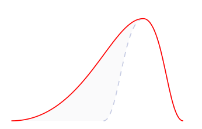
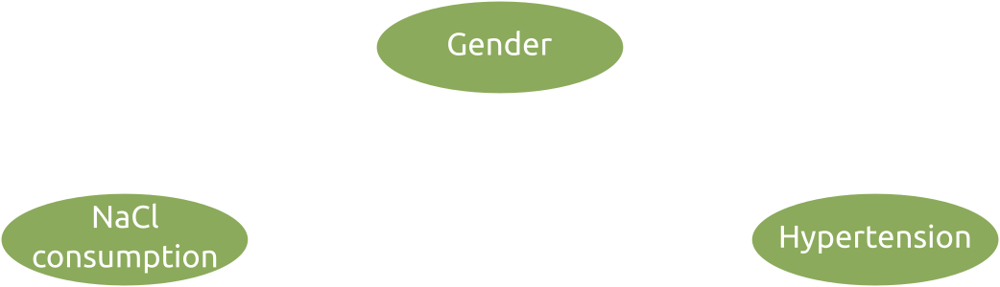
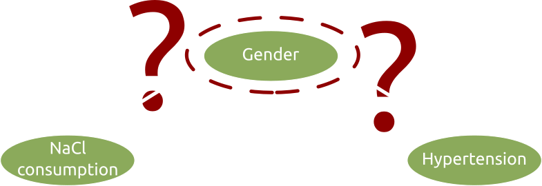
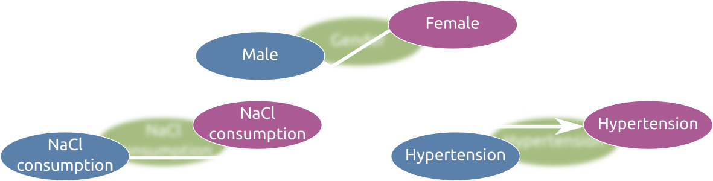
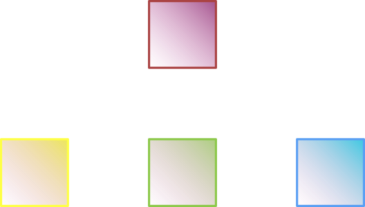
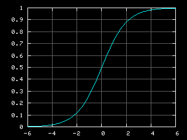

### Class #5

#### Fundamentos de Epidemiologia 2022


Francisco Pina Martins

---

### Bias & Confounding

---

### What is Bias?

* &shy;<!-- .element: class="fragment" -->A systematic error in epidemiological studies
* &shy;<!-- .element: class="fragment" -->Its consequence is an incorrect estimation of an association measure
* &shy;<!-- .element: class="fragment" -->**Not** caused by randomness
* &shy;<!-- .element: class="fragment" -->Distortions due to bias are always in the same direction
* &shy;<!-- .element: class="fragment" -->Can be of various types:
 * &shy;<!-- .element: class="fragment" -->Selection bias
 * &shy;<!-- .element: class="fragment" -->Information bias
 * &shy;<!-- .element: class="fragment" -->Confounding bias

<div class="fragment" style="float:right">



</div>

|||

### Bias types

<div class="fragment" style="float:left;width:25%">

#### Selection bias

* Occurs due to:
 * Improper sampling procedure
 * Incomplete subject participation
* Results in samples not representative of populations

</div>

<div class="fragment" style="float:right;width:30%">

#### Information bias

* Occurs due to:
 * Inaccurate measurements of important variables
* Can happen even if measurement errors are across subjects regardless of *exposure* or *outcome*

</div>

<div class="fragment" style="float:right;width:35%">

#### Confounding bias

* Occurs due to:
 * Variables that influence the measure of association besides *exposure*
* Results in inaccurate calculation of association measures

</div>

---

### Confounding

---

### What is a confounder?

* &shy;<!-- .element: class="fragment" -->Epidemiological studies try to associate *risk factor* to *outcome*
* &shy;<!-- .element: class="fragment" -->Other factors that can also explain such association are called *confounders*
* &shy;<!-- .element: class="fragment" -->Can cause over or under estimate of a measure
* &shy;<!-- .element: class="fragment" -->Are actually very common
* &shy;<!-- .element: class="fragment" -->Can be adjusted for

&shy;<!-- .element: class="fragment" -->

---

### Types of confounding

* &shy;<!-- .element: class="fragment" -->**Confounding**:
 * &shy;<!-- .element: class="fragment" -->Association distortion caused by uneven distribution of other risk factor(s)
* &shy;<!-- .element: class="fragment" -->**Effect Measure Modification**:
 * &shy;<!-- .element: class="fragment" -->Association magnitude is different for different levels of another factor

&shy;<!-- .element: class="fragment" -->

---

### Asking questions considering confounding

* &shy;<!-- .element: class="fragment" -->Does swimming regularly increase the risk of ear infection...
 * &shy;<!-- .element: class="fragment" -->independently of age and gender?
* &shy;<!-- .element: class="fragment" -->Do vitamin supplements help protect against colds...
 * &shy;<!-- .element: class="fragment" -->independently of following a healthy diet?

---

### Controlling confounding

* &shy;<!-- .element: class="fragment" -->Ideally this is done during the study design phase
 * &shy;<!-- .element: class="fragment" -->Restriction
 * &shy;<!-- .element: class="fragment" -->Matching
 * &shy;<!-- .element: class="fragment" -->Randomization
* &shy;<!-- .element: class="fragment" -->If confounding control fails (or is impossible) during the design phase, its effects can be mitigated in the analysis stage

&shy;<!-- .element: class="fragment" -->

|||

### Controlling confounding

#### Restriction

* &shy;<!-- .element: class="fragment" -->Exclude subjects with known confounders
* &shy;<!-- .element: class="fragment" -->Ideal if the variable is a known strong confounder
* &shy;<!-- .element: class="fragment" -->(+) Efficient, inexpensive, simple
* &shy;<!-- .element: class="fragment" -->(-) Excluded variables cannot be assessed, reduces potential participant pool
 * &shy;<!-- .element: class="fragment" -->Eg. Studying melanoma, exclude subjects with hypersensibility to sun exposition

|||

### Controlling confounding

#### Matching

* &shy;<!-- .element: class="fragment" -->Involves constraining the control (C-C studies) or unexposed (Cohort) group
 * &shy;<!-- .element: class="fragment" -->Ensure confounding variable(s) within these groups are similarly distributed to the corresponding distribution within the index group
* &shy;<!-- .element: class="fragment" -->Like a "partial restriction" on confounding variables, since only one group is restricted
* &shy;<!-- .element: class="fragment" -->(+) Increased precision, lower costs due to small sample size requirements
* &shy;<!-- .element: class="fragment" -->(-) Requires more planning, less downstream flexibility, analyses require special consideration, since the control/unexposed group is not random

|||

### Controlling confounding

#### Randomization

* &shy;<!-- .element: class="fragment" -->Simply ensure all variables are randomly distributed across all studied groups
* &shy;<!-- .element: class="fragment" -->Can control both known and unknown confounders
* &shy;<!-- .element: class="fragment" -->Very limited in observational studies
 * &shy;<!-- .element: class="fragment" -->Common in RCTs
* &shy;<!-- .element: class="fragment" -->Assumes that random subject segregation will produce groups with similar confounders' distribution
* &shy;<!-- .element: class="fragment" -->If done correctly, produces homogeneous groups of individuals
* &shy;<!-- .element: class="fragment" -->(+) Very reliable, simple to understand and apply
* &shy;<!-- .element: class="fragment" -->(-) Can't be applied to all study types, requires relatively large sample sizes

---

### But is it *really* a confounder?

* &shy;<!-- .element: class="fragment" -->For a variable to be considered a confounder:
 * &shy;<!-- .element: class="fragment" -->It must be predictive of the health outcome
   * &shy;<!-- .element: class="fragment" -->Independent of the *exposure* factor
   * &shy;<!-- .element: class="fragment" -->Among unexposed individuals, the potentially confounding factor should be related to the outcome
 * &shy;<!-- .element: class="fragment" -->Has to be differently distributed between *exposed* & *unexposed*
   * &shy;<!-- .element: class="fragment" -->Independent of the *outcome*
* &shy;<!-- .element: class="fragment" -->Adjustment of non-confounder variables may introduce bias!

&shy;<!-- .element: class="fragment" -->

---

### Assessing confounder

<div style="color:#fdffb6">

|  **Everyone**        | Anemia | Healthy | Total |
|:---------------------|:------:|:-------:|:-----:|
| Intestinal disorders | 254    | 2220    |  2474 |
| Healthy intestines   | 150    | 1500    |  1650 |

</div>
</br>
<div style="color:#ffadad">

| **Intestinal disorders** | Anemia | Healthy | Total |
|:-------------------------|:------:|:-------:|:-----:|
| Folic acid supplement    | 150    | 1830    |  1980 |
| No folic acid supplement | 104    | 390     |  494  |

</div>
</br>
<div style="color:#caffbf">

| **Healthy intestines**   | Anemia | Healthy | Total |
|:-------------------------|:------:|:-------:|:-----:|
| Folic acid supplement    | 50     | 800     |  850  |
| No folic acid supplement | 100    | 700     |  800  |

</div>

|||

### Assessing confounder

* &shy;<!-- .element: class="fragment" -->Is the variable predictive of the *outcome*?

</br>
</br>

<div class="fragment" style="float:left">

* Risk Ratios

``$$RR_{\overline{E}C} = \frac{Risk_{ \overline{E}C}}{Risk_{ \overline{E} \overline{C} }} $$``

</div>

<div class="fragment" style="float:right">

* Odds Ratios

``$$OR_{\overline{E}C} = \frac{Odds_{ \overline{E}C}}{Odds_{ \overline{E} \overline{C} }} $$``

</div>

<div class="fragment">

</br>
</br>
</br>
</br>
</br>

```R
library(epitools)

healthy_intestines_data = matrix(c(50, 800, 100, 700), byrow=T, 2, 2)
colnames(healthy_intestines_data) = c("Anemia", "Healthy")
rownames(healthy_intestines_data) = c("Takes Folic acid", "No folic acid supplements")

riskratio(healthy_intestines_data, rev="b")
```

</div>

* &shy;<!-- .element: class="fragment" -->If ratio is significantly != 1, there is evidence of confounding

|||

### Assessing confounder

* &shy;<!-- .element: class="fragment" -->Is the variable differentially distributed between E and Ē?

&shy;<!-- .element: class="fragment" -->``$$p = \frac{(a+b)!(c+d)!(a+c)!(b+d)!}{a!b!c!d!n!} $$``

<div style="color:#bde0fe" class="fragment">

| **Everyone**             | Intst. disorders     | Healthy intst.     | Total |
|:-------------------------|:--------------------:|:------------------:|:-----:|
| Folic acid supplement    | 1980                 | 850                |  2830 |
| No folic acid supplement | 494                  | 800                |  1294 |

</div>

<div class="fragment">

```R
independence_table = matrix(c(1980, 850, 494, 800), byrow=T, 2, 2)
colnames(independence_table) = c("Intestinal disorders", "Healthy intestines")
rownames(independence_table) = c("Takes Folic acid", "No folic acid supplements")
fisher.test(independence_table)
chisq.test(independence_table)
```

</div>

* &shy;<!-- .element: class="fragment" -->If *p*<=0.05, there is evidence of confounding

---

### What about Effect Measure Modification (EMM)?

* &shy;<!-- .element: class="fragment" -->While confounding is a distortion, EMM is of studying interest
* &shy;<!-- .element: class="fragment" -->EMM does not "compete" with *exposure* for explaining the *outcome*
 * &shy;<!-- .element: class="fragment" -->EMM IDs subpopulations differentially susceptible to *exposure*
 * &shy;<!-- .element: class="fragment" -->Eg. A drug use education program that is more effective in young than older audiences
* &shy;<!-- .element: class="fragment" -->When present, it makes identifying confounding much harder! 

&shy;<!-- .element: class="fragment" -->

---

### Identifying EMM

* &shy;<!-- .element: class="fragment" -->We need to calculate 3 measures of association:
 * &shy;<!-- .element: class="fragment" -->The *crude* measure of association (C)rude
 * &shy;<!-- .element: class="fragment" -->The measure of association using only subjects **affected** by the variable of interest (A)ffected
 * &shy;<!-- .element: class="fragment" -->The measure of association using only subjects **not affected** by the variable of interest (U)naffected
* &shy;<!-- .element: class="fragment" -->EMM is likely if `A < C < U` or `A > C > U`
 * &shy;<!-- .element: class="fragment" -->There is no rule of thumb to decide how different `A, C and U` must be in order to identify EMM
* &shy;<!-- .element: class="fragment" -->If there is no evidence of EMM, the crude measure can be tweaked

---

### What if there is evidence of confounding?

* &shy;<!-- .element: class="fragment" -->In this case, *RR* or *OR* needs to be tweaked
 * &shy;<!-- .element: class="fragment" -->Unadjusted value is sometimes referred to as *Crude* measure
 * &shy;<!-- .element: class="fragment" -->Tweaked value is called *Adjusted* measure
* &shy;<!-- .element: class="fragment" -->To do this, the data must be *stratified*
* &shy;<!-- .element: class="fragment" -->*Mantel-Haenszel adjusted measures of association*

&shy;<!-- .element: class="fragment" -->

|||

### What if there is evidence of confounding?

```R
install.packages("epiR")
library(epiR)

# Create our dataframe:
counts = matrix(c(0, 0 , 0, 0), 8, 4)
colnames(counts) = c("Anemia", "Intst.disorders", "Folic_acid", "Freq")
counts[1,] = c(1, 1 , 1, 150)
counts[2,] = c(1, 1 , 0, 104)
counts[3,] = c(1, 0 , 1, 50)
counts[4,] = c(1, 0 , 0, 100)
counts[5,] = c(0, 1 , 1, 1830)
counts[6,] = c(0, 1 , 0, 390)
counts[7,] = c(0, 0 , 1, 800)
counts[8,] = c(0, 0 , 0, 700)

# Transform the DF into stratified tables
stratified_table <- xtabs(Freq ~ Intst.disorders + Anemia + Folic_acid, data = counts)
print(stratified_table)

# Finally, claculate our adjusted values
adj_values = epi.2by2(dat = stratified_table, method = "cohort.count", 
                      conf.level = 0.95, units = 100, outcome = "as.columns")
print(adj_values)
```

* &shy;<!-- .element: class="fragment" -->Differences > 10% between crude and adjusted values suggest confounding
* &shy;<!-- .element: class="fragment" -->Significant Chi² results suggest EMM

---

### How to handle more than one confounder?

* &shy;<!-- .element: class="fragment" -->Stratification will only get you so far
* &shy;<!-- .element: class="fragment" -->For more than one confounder you need *logistic regression*
* &shy;<!-- .element: class="fragment" -->Can also work with non-binary data

&shy;<!-- .element: class="fragment" -->``$$y = a + b_1 + b_2 ... + b_i $$``

<div class="fragment" style="float:left">

* Where:
 * *y* = outcome
 * *a* = intercept
 * *b<sub>1</sub>* = exposure
 * *b<sub>i</sub>* = confounders

</div>

<div class="fragment" style="float:right">



</div>

|||

### Logistic regression example

```R
gloves2 = read.csv("C05_assets/gloves_plus.csv", sep = ";")[,-1]

# Previous way
library(epitools)
gtable = table(gloves2[,-c(3,4)])
oddsratio.wald(gtable)

# Confounder stratification
library(epiR)
conf_table = table(gloves2[,-4])
adj_values = epi.2by2(dat = conf_table, method = "case.control", 
                      conf.level = 0.95, units = 100, outcome = "as.columns")
print(adj_values)

## Logit regression way
my_model = glm(Skin.rash ~ Latex_gloves, data=gloves2, family=binomial(link="logit"))
summary(my_model)

library(MASS)
exp(cbind(coef(my_model), confint(my_model)))

# Expand to a confounder
my_conf_model = glm(Skin.rash ~ Latex_gloves*Female, data=gloves2, family=binomial(link="logit"))
summary(my_conf_model)
exp(cbind(coef(my_conf_model), confint(my_conf_model)))

# Expand to 2 confounders
my_large_model = glm(Skin.rash ~ Latex_gloves*Female*Age.below.30, data=gloves2, family=binomial(link="logit"))
summary(my_large_model)
exp(cbind(coef(my_large_model), confint(my_large_model)))

# Remove one interaction
my_single_model = glm(Skin.rash ~ Latex_gloves*Female*Age.below.30 - Female:Age.below.30, data=gloves2, family=binomial(link="logit"))
summary(my_single_model)
exp(cbind(coef(my_single_model), confint(my_single_model)))
```

---

### References

* [Types of bias](https://sph.unc.edu/wp-content/uploads/sites/112/2015/07/nciph_ERIC14.pdf)
* [ERIC](https://sph.unc.edu/wp-content/uploads/sites/112/2015/07/nciph_ERIC11.pdf)
* [Confounding in linear regression](https://sphweb.bumc.bu.edu/otlt/MPH-Modules/PH717-QuantCore/PH717_MultipleVariableRegression/PH717_MultipleVariableRegression5.html)
* [Epi.2by2](https://www.rdocumentation.org/packages/epiR/versions/2.0.19/topics/epi.2by2)
* [Assessing EMM](https://sph.unc.edu/wp-content/uploads/sites/112/2015/07/nciph_ERIC12.pdf)
* [EMM from scratch](https://sphweb.bumc.bu.edu/otlt/MPH-Modules/BS/BS704-EP713_Confounding-EM/BS704-EP713_Confounding-EM8.html)
* [Confounding & EMM](https://open.oregonstate.education/epidemiology/chapter/effect-modification/)
* [Using a GLM](https://stackoverflow.com/a/54036783/3091595)
